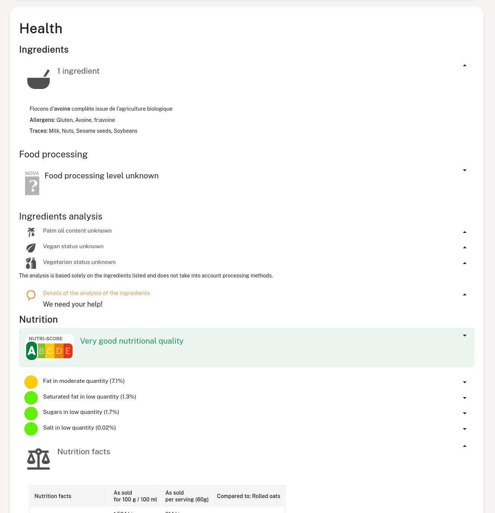

# Explanation on Knowledge panels

The Open Food Facts API allows clients (such as the Open Food Facts website and mobile app) to request ready-to-display information about an object (such as a product or a facet like a category).

Clients do not have to know in advance what kind of information is displayed (for example - the ingredients of a product, nutrition data, Nutri-Score or Eco-Score). They only have to know how to display essential data types such as texts, grades, images, and tables.

  
Knowledge panels in action on the mobile app

Main elements are panels, which in turn will contain elements. Elements are typically `text_element`, `image_element`, `map_element`. Some panels are grouping panels together, forming a hierarchy.

The structure of the knowledge panels data returned by the API is described in the [knowledge panels JSON schema](./ref/schemas/knowledge_panels/panels.yaml).

> See the reference documentation for [Getting Knowledge panels for a specific product by barcode](https://openfoodfacts.github.io/openfoodfacts-server/api/ref-v2/#get-/api/v2/product/-barcode--fields-knowledge_panels).
