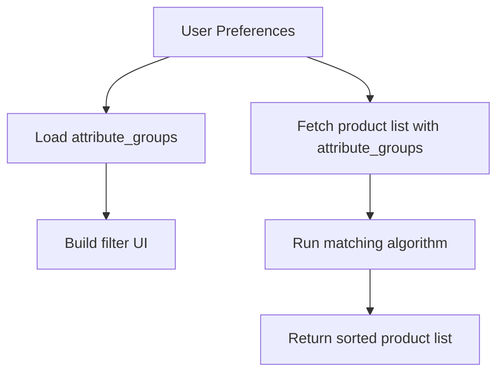

# 🎯 Tutorial: Personalizing Product Matching with Open Food Facts Attributes API

**Objective:**
Leverage the Open Food Facts API to dynamically personalize product recommendations based on user preferences using `attributes` and `attribute_groups`, avoiding hardcoding logic, and preserving user privacy

---

## Core Concepts

### What are Product Attributes?

Product attributes describe key characteristics and compliance information about food products, such as:

* `nutriscore`
* `nova-group`
* `labels` (e.g. "organic", "fair-trade")
* `ingredients_analysis` (e.g. "palm-oil-free", "vegan")
* `allergens`

Note: We have experimental yet limited support for cosmetics, pet food and other products.

### Why Use the `/attribute_groups` endpoint?

The `/attribute_groups` endpoint provides the **taxonomy and metadata** needed to dynamically generate:

* Matching logic
* Preference UI
* Labels, icons, descriptions, scores, etc.

Avoid hardcoding. Future-proof your app.

📘 Reference: [https://openfoodfacts.github.io/openfoodfacts-server/api/ref-v2/#get-/api/v2/attribute\_groups](https://openfoodfacts.github.io/openfoodfacts-server/api/ref-v2/#get-/api/v2/attribute_groups)
📘 Concepts: [https://wiki.openfoodfacts.org/Product\_Attributes](https://wiki.openfoodfacts.org/Product_Attributes)

---

## Prerequisites

* REST client (Postman, curl, JS/TS, Python requests, etc.)
* Basic understanding of JSON and REST APIs
* A list of user preferences (e.g. wants organic, avoids palm oil, prefers NutriScore A/B)

---

## 🚀 Step-by-Step Guide

---

### ✅ STEP 1 — Retrieve the attribute taxonomy

```http
GET https://world.openfoodfacts.org/api/v2/attribute_groups
```

#### Response Sample:

```json
{
  "attribute_groups": [
    {
      "id": "nutriscore",
      "name": "Nutri-Score",
      "attributes": [
        {
          "id": "nutriscore-a",
          "name": "Nutri-Score A",
          "match": 1,
          "icon_url": "https://.../nutriscore-a.svg"
        },
        ...
      ]
    },
    ...
  ]
}
```

🧩 Use this to dynamically build UI filters and assign matching scores.

---

### ✅ STEP 2 — Define user preferences

Example user preferences (in your code):

```json
{
  "preferred_attributes": ["nutriscore-a", "labels-organic", "ingredients-analysis-palm-oil-free"],
  "avoided_attributes": ["labels-gluten-free"]  // optional if user has no dietary constraint
}
```

---

### ✅ STEP 3 — Fetch product(s) with attributes

Use `attribute_groups` in the `fields` parameter.

```http
GET https://world.openfoodfacts.org/api/v2/product/3700214614266?fields=product_name,code,attribute_groups
```

#### Response Sample:

```json
{
  "product": {
    "product_name": "Organic Apple Juice",
    "code": "3700214614266",
    "attribute_groups": [
      {
        "id": "labels",
        "attributes": [
          {
            "id": "labels-organic",
            "status": "present",
            "match": 1
          },
          {
            "id": "labels-gluten-free",
            "status": "not_present",
            "match": 0
          }
        ]
      },
      {
        "id": "nutriscore",
        "attributes": [
          {
            "id": "nutriscore-a",
            "status": "present",
            "match": 1
          }
        ]
      }
    ]
  }
}
```

---

### ✅ STEP 4 — Match products to preferences

#### Matching algorithm (simplified):

Here's the scoring algorithm in Javascript: https://github.com/openfoodfacts/openfoodfacts-server/blob/main/html/js/product-search.js
You can adapt it to your programming language

💡 Use this score to **rank products**.

---

### ✅ STEP 5 — Match lists of products (batch processing)

Use the `/api/v2/search` endpoint with the `fields=attribute_groups` query to fetch multiple products efficiently:

```http
GET https://world.openfoodfacts.org/api/v2/search?code=3700214614266,3274080005003,3017620429484&fields=product_name,code,attribute_groups
```

Parse the `products` array and apply the `match_product()` function to each item to build a personalized list.

---

## 🔄 Going Further: Dynamic UIs

* Use the `/attribute_groups` data to **generate user-facing preference selectors** dynamically.
* Use `match` field to build **"smart filters"** based on what Open Food Facts knows.
* Internationalization: retrieve `name`, `description`, `icon_url` in the user’s language (via `lc=fr`, `lc=en`, etc.)

---

## ✅ Final Example: Personalized Product Matching Pipeline



---

## 🧪 Test URLs

* Product: [Organic Apple Juice](https://world.openfoodfacts.org/api/v2/product/3700214614266?fields=product_name,attribute_groups)
* Attributes: [attribute\_groups](https://world.openfoodfacts.org/api/v2/attribute_groups)

---

## 📌 Key Benefits

✅ **Future-proof**: Your app adapts automatically to new attributes
✅ **Customizable**: Users define what matters to them
✅ **International**: Attributes are localized and translatable
✅ **Scalable**: Works with individual products or entire lists

---

## 🤖 Bonus: Ready-to-Use SDKs and Wrappers

Want to speed things up? Use one of the Open Food Facts SDKs or contribute your own!

* [openfoodfacts-python](https://github.com/openfoodfacts/openfoodfacts-python)
* [openfoodfacts-dart](https://github.com/openfoodfacts/smooth-app)

## Elsewhere
* Fuller documentation available at https://wiki.openfoodfacts.org/Product_Attributes
